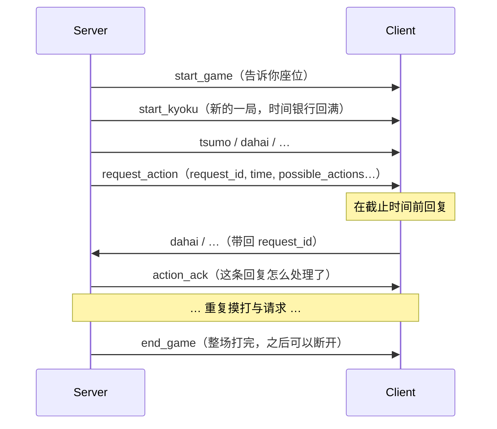

# Room WebSocket 协议

负责对局过程里客户端和服务端的通信。每条消息都是一条文本 JSON。

```text
/ws/room/{room_id}?player_id={player_id}
```

`room_id` 和 `player_id` 从 lobby 那边拿到（见 [lobby.md](lobby.md)）。

对局信息采用 MJAI 协议。鉴于网络上的 MJAI 协议被大量拓展，这里采用和 riichienv 一致的格式。



`request_action` 里有这次请求的 `request_id`，还有剩余的思考时间。回动作时要带上同一个 `request_id`。服务端处理（或超时后默认代打）后会单独给你发一条 `action_ack`。

不认识的 `type` 和不认识的字段请直接跳过。

## Server 下行消息

### `start_game`

连上房间后会发一次，告诉你坐哪。

```json
{"type":"start_game","id":0}
```

- `id` — 你的座位（0–3）

### `start_kyoku`

每一局开始时发。

```json
{
  "type": "start_kyoku",
  "bakaze": "E",
  "dora_marker": "2p",
  "kyoku": 1,
  "honba": 0,
  "kyotaku": 0,
  "oya": 0,
  "scores": [25000, 25000, 25000, 25000],
  "tehais": [
    ["1m","3m","5m","7p","9s"],
    ["?","?","?","?","?"],
    ["?","?","?","?","?"],
    ["?","?","?","?","?"]
  ]
}
```

- `dora_marker` — 开局那一张宝牌指示牌，就是个字符串，不是数组
- `scores` — 四人现在的点数
- `tehais` — 四人起手；你只能看到自己的牌，别人的都是 `"?"`

### `tsumo`

摸牌。别人摸到什么你看不到，`pai` 会是 `"?"`。

```json
{"type":"tsumo","actor":0,"pai":"3m"}
```

### `dahai`

打牌。

```json
{"type":"dahai","actor":0,"pai":"3m","tsumogiri":true}
```

### `chi` / `pon` / `daiminkan` / `ankan` / `kakan`

吃碰杠。

```json
{"type":"chi","actor":1,"target":0,"pai":"5m","consumed":["4m","6m"]}
{"type":"pon","actor":2,"target":0,"pai":"E","consumed":["E","E"]}
{"type":"daiminkan","actor":2,"target":0,"pai":"E","consumed":["E","E","E"]}
{"type":"ankan","actor":0,"pai":"1s","consumed":["1s","1s","1s","1s"]}
{"type":"kakan","actor":0,"pai":"5m","consumed":["5m","5m","5m"]}
```

- `pai` — 叫到的那张（别人打出来的，或者加杠加上去的那张）；暗杠则是杠的那种牌
- `consumed` — 从手里拿出来的牌。**加杠这里写的是原来碰上的 3 张**，不是只写刚加上的那 1 张

### `dora`

有人杠完之后，新翻出来的宝牌指示牌。

```json
{"type":"dora","dora_marker":"3m"}
```

### `reach` / `reach_accepted`

先发 `reach` 表示立直宣言，真正那张切牌还是后面的 `dahai`。如果宣言之后没被荣和打断，再发 `reach_accepted`，这时已经扣了 1000 点进供托。

```json
{"type":"reach","actor":0}
{"type":"reach_accepted","actor":0}
```

### `hora`

和牌。

```json
{
  "type": "hora",
  "actor": 0,
  "target": 1,
  "deltas": [12000, -12000, 0, 0],
  "ura_markers": ["1p"],
  "tsumo": true
}
```

- `actor` — 谁和了；`target` — 谁放铳（自摸的话 `target` 和 `actor` 一样）
- `deltas` — 四人点数怎么变（本场、供托都已经算进去了）
- `ura_markers` — 里宝指示牌；没立直就是空数组 `[]`
- `tsumo` — 自摸才写 `true`；荣和干脆不写这个字段
- 这条消息里**没有** `pai` 字段

### `ryukyoku`

流局。

```json
{"type":"ryukyoku","reason":"exhaustive_draw","deltas":[3000,-1000,-1000,-1000]}
```

荒牌流局亮牌时，可能还会带 `tehais`。

| reason | 意思 |
|---|---|
| `exhaustive_draw` | 荒牌 |
| `kyushu_kyuhai` | 九种九牌 |
| `sufuurenta` | 四风连打 |
| `suukansansen` | 四杠散了 |
| `suucha_riichi` | 四家立直 |
| `sanchaho` | 三家和 |

罚符流局也会走这条，`reason` 是另一段说明文字，`deltas` 一般不是 0（见下面的犯规部分）。

### `end_kyoku`

这一局打完了。点数怎么变已经写在前面的 `hora` / `ryukyoku` 里了，这条只是告诉你：局结束了。

```json
{"type":"end_kyoku"}
```

### `end_game`

整场结束，带着最终点数。收到之后可以断开连接。

```json
{"type":"end_game","scores":[30000,25000,20000,25000]}
```

### `action_ack`

你对某次 `request_action` 回了动作（或者超时被代打）之后，服务端会**只给你**发这条回执。简单的客户端可以不看。

```json
{
  "type": "action_ack",
  "request_id": 42,
  "status": "accepted",
  "elapsed_ms": 850,
  "bank_consumed_ms": 0,
  "bank_ms": 20000
}
```

| status | 意思 | 分数 |
|---|---|---|
| `accepted` | 你的动作已经进对局了 | 不变 |
| `rejected` | 能解析，但不在合法列表里（会带 `reason` / `attempted` / `legal_types`） | 罚满贯（chombo） |
| `unparseable` | 解析不了，或没带 `request_id`；丢掉，当没发生过 | 不罚 |
| `stale` | 来晚了，或者 `request_id` 已经过期，丢掉 | 不罚 |
| `defaulted` | 超时了，服务端帮你打了；`action` 就是代打内容 | 不罚，时间银行清零 |

超时被代打的例子：

```json
{
  "type": "action_ack",
  "request_id": 42,
  "status": "defaulted",
  "action": {"type": "dahai", "pai": "7s", "tsumogiri": true},
  "elapsed_ms": 25001,
  "bank_consumed_ms": 20000,
  "bank_ms": 0
}
```

### `request_action`

轮到你做决定时发过来：这次请求的编号、还剩多少时间、你现在能做什么。

```json
{
  "type": "request_action",
  "request_id": 42,
  "time": {"grace_ms": 5000, "bank_ms": 20000, "deadline_ms": 25000},
  "possible_actions": [
    {"type": "dahai", "pai": "1m"},
    {"type": "dahai", "pai": "3m"},
    {"type": "reach"},
    {"type": "hora"},
    {"type": "none"}
  ],
  "observation": "eyJwbGF5ZXJfaWQiOjAs..."
}
```

#### `request_id`

整场对局里一路往上加，每次请求都不一样。回的时候原样带回去。如果回得太晚，不会被当成下一次请求的答案。

#### `time`

看消息里写的数就行。

| 字段 | 意思 |
|---|---|
| `grace_ms` | 每次请求开头的免费思考时间（一般是5s） |
| `bank_ms` | 这一局里还剩多少时间银行（一般是20s） |
| `deadline_ms` | 免费时间 + 银行；超过就代打 |

#### `possible_actions`

你现在允许做的动作。格式和 MJAI 差不多，但**没有** `actor`——座位已经由这条连接决定了。你回的内容必须能对上这里面的某一条。

| type | 字段 | 意思 |
|---|---|---|
| `dahai` | `pai`；摸切时再带 `tsumogiri: true` | 出牌 |
| `chi` / `pon` | `pai`, `consumed`（2 张） | 吃 / 碰 |
| `daiminkan` | `pai`, `consumed`（3 张） | 大明杠 |
| `ankan` | `consumed`（4 张） | 暗杠 |
| `kakan` | `pai`, `consumed`（3 张，原来的碰） | 加杠 |
| `reach` | （无） | 立直；切哪张另外再发 `dahai` |
| `hora` | 可以带 `target` / `pai` | 和（自摸或荣） |
| `ryukyoku` | （无） | 九种九牌这类中途流局 |
| `none` | （无） | 过，不鸣 |

#### `observation`

这个空字段是留给未来的。

## Client 上行消息

收到 `request_action` 之后回一条 JSON，带上对应的 `request_id`。多出来的字段服务端会忽略。座位以你这条连接为准；就算写了 `actor` 也不生效。

| type | 必填 | 备注 |
|---|---|---|
| `dahai` | `pai` | 不写 `tsumogiri` 就当 `false` |
| `chi` / `pon` | `pai`, `consumed`（2 张） | |
| `daiminkan` | `pai`, `consumed`（3 张） | |
| `ankan` | `consumed`（4 张） | |
| `kakan` | `pai`, `consumed`（3 张） | 在已有碰上加杠 |
| `reach` | （无） | 切牌另外发 `dahai` |
| `hora` | （无） | 自摸还是荣和由服务端判断；也可以带 `target` / `pai` |
| `ryukyoku` | （无） | 九种九牌等 |
| `none` | （无） | 这次鸣牌机会不要了 |

```json
{"type":"dahai","pai":"3m","tsumogiri":true,"request_id":42}
{"type":"chi","pai":"5m","consumed":["4m","6m"],"request_id":42}
{"type":"reach","request_id":42}
{"type":"hora","target":2,"pai":"5m","request_id":42}
{"type":"none","request_id":42}
```

### `request_id` 怎么对上

| 上行消息 | 服务端处理 |
|---|---|
| 带回当前那次的 `request_id` | 正常处理 |
| 带回更早的旧 `request_id` | `action_ack` 里标 `stale`，丢掉，不罚分 |
| 带回从没见过 / 还没到的 `request_id` | `action_ack` 里标 `stale`，丢掉，不罚分 |
| 根本不带 `request_id` | `action_ack` 里标 `unparseable`，丢掉，当没发生过 |

## 牌的表示方法

| 花色 | 写法 |
|---|---|
| 万 | `1m` … `9m` |
| 筒 | `1p` … `9p` |
| 索 | `1s` … `9s` |
| 风 | `E` `S` `W` `N` |
| 箭 | `P`（白）`F`（发）`C`（中） |
| 赤宝 | `5mr` `5pr` `5sr` |

别人看不见的牌写成 `"?"`。

## 时间、代打、犯规

### 时间：免费段 + 每局银行（默认 5s + 20s）

- **免费段（grace）**：每次轮到你，开头有一段不扣银行的时间；超过这段才开始吃银行。
- **银行（bank）**：每局开始回满，局与局之间不结转；自己摸打和别人打牌后的鸣牌机会共用这一份。
- **截止（deadline）**：免费段 + 还剩的银行。超时就把银行清零，服务端代打并继续：
  - 轮到你摸打 → 摸切（`dahai` + `tsumogiri`）
  - 轮到你决定要不要鸣 → `{"type":"none"}`

光是超时不扣分。计时从发出 `request_action` 那一刻开始。

### 回晚了怎么办

如果你带了 `request_id`：旧的 id 一律算 `stale`，绝不会拿去顶新请求。最坏就是被代打，不会因为“手慢绑定错题”被罚满贯。

### 解析失败 / 没带 `request_id` → 丢掉

JSON 解析不了，或者没带 `request_id`：服务端直接丢掉，对局状态不变，只给你回一条 `action_ack`（`status: unparseable`），并继续等待正常回复，直到超时。

### 非法动作 → 罚满贯（chombo）

动作能解析，但不在 `possible_actions` 里，存在作弊嫌疑，会被罚满贯：

```json
{"type":"ryukyoku","reason":"Error: Illegal Action by Player 0","deltas":[-12000,4000,4000,4000]}
```

点数怎么分（示意）：

- 亲家犯规：自己 −12000，三家闲家各 +4000
- 闲家犯规：自己 −8000，亲家 +4000，另外两家闲家各 +2000

这一局马上结束，并且连庄。回动作前务必对照 `possible_actions` 检查一遍。

### 断线

人断了就当断线：后面该你出的牌一律代打，额外不罚分（和超时一样）。中途不能重连。
